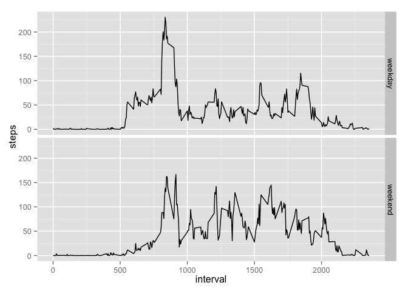

# Reproducible Research: Peer Assessment 1


## Loading and preprocessing the data

1. Load the data


```r
if(!file.exists("activity.csv")) {
  unzip('activity.zip')
}

dataset <- read.csv('activity.csv')
dataset$date <- as.Date(strptime(dataset$date, format="%Y-%m-%e"))
```

## What is mean total number of steps taken per day?

### Total number of steps taken per day.


```r
# Calculating steps by day
steps.by.day <- dataset[!is.na(dataset$steps),] %>%
                select(steps, date) %>%
                group_by(date) %>%
                summarise_each(funs(mean(.)))

# Creating histogram for steps by day.
plot <- ggplot(steps.by.day, aes(steps)) + geom_histogram(binwidth=10)
print(plot)
```

 

### Mean and median

#### Mean:


```r
mean.steps <- mean(steps.by.day$steps)
mean.steps
```

```
## [1] 37.3826
```

#### Median:


```r
median.steps <- median(steps.by.day$steps)
median.steps
```

```
## [1] 37.37847
```

## What is the average daily activity pattern?


```r
# Calculating steps by day
steps.by.interval <- dataset %>%
                     select(steps, interval) %>%
                     group_by(interval) %>%
                     summarise_each(funs(mean(., na.rm=TRUE)))

max.steps <- steps.by.interval %>%
             filter(steps == max(steps.by.interval$steps))

# Creating histogram for steps by day.
plot <- ggplot(steps.by.interval, aes(interval, steps)) + geom_line() + geom_vline(xintercept=max.steps$interval, colour="red")
print(plot)
```

 

### Interval which contains the maximum number of steps


```r
max.steps$interval
```

```
## [1] 835
```

## Imputing missing values

### total number of missing values in the dataset


```r
total.missing.values <- nrow(dataset) - sum(complete.cases(dataset))
total.missing.values
```

```
## [1] 2304
```

### Fill the missing values

Filling missing values with the mean of each interval


```r
dataset.without.na <- dataset %>%
                      group_by(interval) %>%
                      mutate(steps=ifelse(is.na(steps), mean(steps, na.rm=TRUE), steps))
```


```r
interval.without.na <- dataset %>%
                       select(steps, interval) %>%
                       group_by(interval) %>%
                       mutate(steps=ifelse(is.na(steps), mean(steps, na.rm=TRUE), steps))
```

The new dataset without NA


```r
summary(dataset.without.na$steps)
```

```
##    Min. 1st Qu.  Median    Mean 3rd Qu.    Max. 
##    0.00    0.00    0.00   37.38   27.00  806.00
```


```r
plot <- ggplot(dataset.without.na, aes(steps)) + geom_histogram(binwidth=100)
print(plot)
```

 

### Mean and median

#### Mean:

The value for the mean is the same.

```r
mean.steps <- mean(dataset.without.na$steps)
mean.steps
```

```
## [1] 37.3826
```

#### Median:

The value for the median differs from the the first part of the assignment.


```r
median.steps <- median(dataset.without.na$steps)
median.steps
```

```
## [1] 0
```

## Are there differences in activity patterns between weekdays and weekends?


```r
dataset2 <- dataset.without.na %>%
            mutate(day.type=ifelse(isWeekday(date), "weekday", "weekend"))

dataset2$day.type <- as.factor(dataset2$day.type)

steps.by.interval <- dataset2 %>%
                     select(steps, interval, day.type) %>%
                     group_by(day.type, interval) %>%
                     summarise_each(funs(mean(.)))
summary(steps.by.interval)
```

```
##     day.type      interval          steps        
##  weekday:288   Min.   :   0.0   Min.   :  0.000  
##  weekend:288   1st Qu.: 588.8   1st Qu.:  2.047  
##                Median :1177.5   Median : 28.133  
##                Mean   :1177.5   Mean   : 38.988  
##                3rd Qu.:1766.2   3rd Qu.: 61.263  
##                Max.   :2355.0   Max.   :230.378
```

```r
plot <- ggplot(steps.by.interval, aes(interval, steps)) + geom_line() + facet_grid(day.type~.)
print(plot)
```

 
